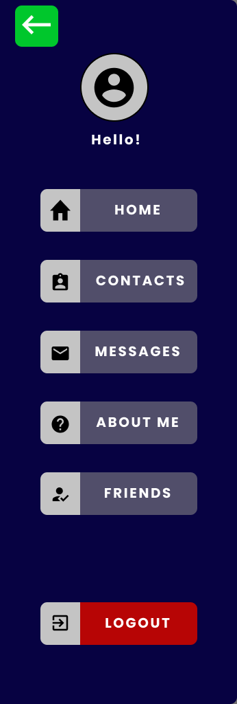
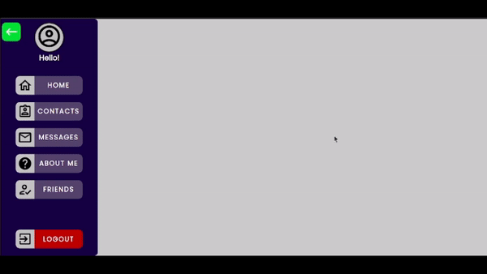

# Navbar

Animated Navbar made with HTML5, CSS3 and Javascript, created for use in future projects that include fixed Navbar.
## :art: Layout


## :desktop_computer: Presentation

## :paperclip: Technologies

- **HTML5**
- **CSS3**
- **Javascript**

## :gear: How to use
Just download the project and run **index.html** in your favorite browser. 
```or```
The **index.html** can be run by [Live Server](https://marketplace.visualstudio.com/items?itemName=ritwickdey.LiveServer), which must be installed as [Visual Studio Code](https://code.visualstudio.com/) plugin.
